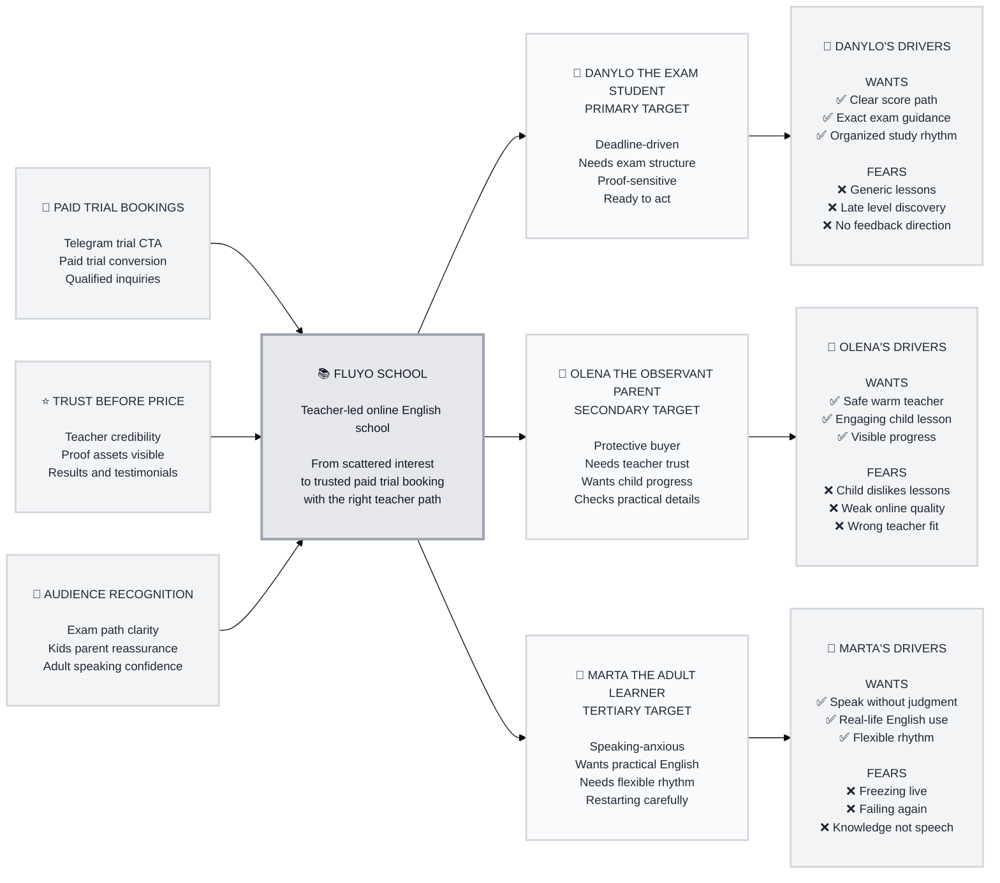

# Trigger Map: fluyo-school

> Visual overview connecting Fluyo School's business goals to user psychology

**Created:** 2026-06-25  
**Author:** king  
**Methodology:** Based on Effect Mapping by Mijo Balic & Ingrid Domingues, adapted for the WDS framework  

---

## Vision

Fluyo School should become the trusted, premium-feeling first step for Ukrainian learners and parents who want English to feel natural, practical, and supported by real teachers.

The landing page should turn interest into paid trial lesson bookings by making each visitor quickly feel: "This is the right school for my goal, I understand the first step, and I trust the people behind it."

---

## Trigger Map Visualization

---

## Strategic Summary

**Primary Target:** Danylo the Deadline-Driven Exam Student.

**Key Transformation:** from "I am interested, but I need proof and clarity before I pay for a trial" into "I understand my path, I trust the teachers, I know what the trial does, and I am ready to message Fluyo on Telegram."

### The Flywheel

1. **Paid trial bookings:** qualified visitors message Fluyo through Telegram.
2. **Good-fit trial lessons:** trial conversations clarify goal, level, teacher fit, and format.
3. **Regular learners:** successful trials become ongoing students.
4. **Visible proof:** testimonials, results, screenshots, and teacher credibility strengthen trust.
5. **Better future conversion:** new visitors see stronger proof and need less persuasion.

---

## Detailed Documentation

### Business Strategy

**Document:** [01-Business-Goals.md](01-Business-Goals.md)

**Priority goals:**

- **Turn Qualified Interest Into Paid Trial Bookings:** primary engine for the landing page.
- **Build Trust Before The Visitor Compares Price:** proof must make a paid first step feel justified.
- **Make Each Launch Audience Feel Immediately Recognized:** exams, kids/parents, and adults need clear paths.

**Top objective:** Telegram trial inquiries that become paid trial bookings, not raw CTA clicks alone.

### Target Users

**Document:** [02-Target-Groups.md](02-Target-Groups.md)

**Persona documents:**

- [Danylo the Exam Student](02-Danylo-the-Exam-Student.md)
- [Olena the Observant Parent](03-Olena-the-Observant-Parent.md)
- [Marta the Adult Learner](04-Marta-the-Adult-Learner.md)

**Primary:** Danylo the Deadline-Driven Exam Student

- Needs exam-specific structure and proof.
- Has high urgency and clear conversion intent.
- Rejects vague "English for all levels" messaging.

**Secondary:** Olena the Observant Parent

- Needs emotional safety, teacher warmth, and parent-visible progress.
- Compares lesson quality, format, and fit before booking.
- Can create retention and parent referrals if trust is earned.

**Tertiary:** Marta the Momentum-Seeking Adult

- Needs practical speaking confidence without shame.
- Wants flexible formats and real-life English.
- Expresses the "English in flow" brand promise.

### Driving Forces

**Document:** [03-Driving-Forces.md](03-Driving-Forces.md)

**Danylo must believe:** Fluyo can diagnose his current level, guide his exact exam preparation, and avoid wasting weeks.

**Olena must believe:** her child will be safe, engaged, properly matched, and visibly progressing.

**Marta must believe:** she can start speaking again without judgment and finally turn knowledge into usable speech.

### Prioritization

**Document:** [04-Prioritization.md](04-Prioritization.md)

**Must Address:**

- Paid trial clarity.
- Exam-specific credibility.
- Teacher trust.
- Path-specific proof.
- Transparent pricing and formats.

**Should Address:**

- Parent progress visibility.
- Lesson screenshots and material examples.
- Adult real-life topic examples.
- Level and format matching.
- Native UA/EN content quality.

### Feature Impact

**Document:** [feature-impact-analysis.md](feature-impact-analysis.md)

**Checklist alias:** [06-Feature-Impact.md](06-Feature-Impact.md)

**Highest-scoring feature priorities:**

- Audience path routing.
- How learning works sequence.
- Teacher proof section.
- Programs and pricing section.
- Context-aware Telegram booking flow.
- Final CTA section.
- Bilingual UA/EN support.

---

## Design Focus Statement

Design the Fluyo School landing page primarily for **Danylo the Deadline-Driven Exam Student**, while strongly supporting **Olena the Observant Parent** and keeping **Marta the Momentum-Seeking Adult** visible as the broad confidence path.

The page must route visitors quickly, prove teacher-led trust, show the trial's value, make pricing understandable, and make Telegram the obvious next step.

---

## How To Read This Map

Read the diagram left to right:

- **Business Goals:** what the page must achieve for Fluyo.
- **Fluyo School:** the central product experience connecting business intent to user psychology.
- **Target Groups:** the people whose decisions drive those goals.
- **Driving Forces:** what each persona wants and fears in the landing-page decision context.

Read priority from top to bottom:

- Danylo receives the most design attention.
- Olena receives strong secondary support.
- Marta remains visible as the broad adult confidence path.

Read driver symbols:

- `✅` marks positive drivers: what pulls the visitor forward.
- `❌` marks negative drivers: what risk, pain, or uncertainty the page must reduce.

---

## Next Use

Use this map to guide:

- **Phase 3: UX Scenarios:** start with paid trial booking and exam-prep path scenarios.
- **Phase 4: UX Design:** prioritize top-scoring feature-impact areas.
- **Implementation:** protect proof, pricing clarity, bilingual content, and Telegram flow from being treated as optional polish.

---

_Generated with Whiteport Design Studio framework_  
_Trigger Mapping methodology credits: Effect Mapping by Mijo Balic & Ingrid Domingues, adapted with negative driving forces_
