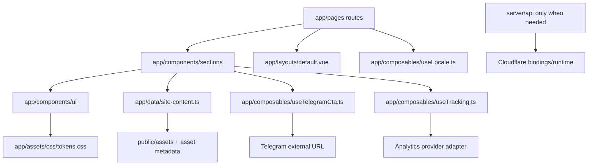
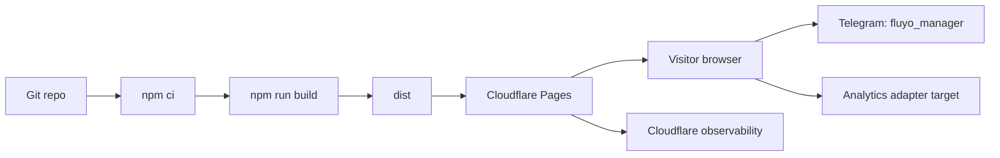
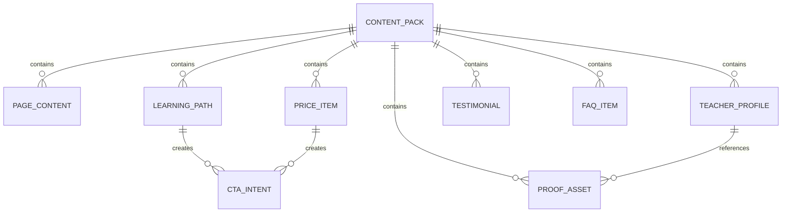

# Architecture Spine - Fluyo School Production Architecture

## Design Paradigm

Use a layered Nuxt presentation architecture:



Routes compose sections. Sections consume typed content, UI primitives, and composables. UI primitives consume only tokens. Platform code stays in Nitro/server or Cloudflare config. No lower layer imports a route.

## Invariants & Rules

### AD-1 - Layered Nuxt dependency direction

- **Binds:** all app source.
- **Prevents:** independently built pages creating incompatible content access, UI primitives, CTA behavior, or platform assumptions.
- **Rule:** `app/pages` and layouts may compose sections; `app/components/sections` may consume typed content, UI primitives, and composables; `app/components/ui` may consume only CSS tokens and framework primitives; `server/` may not import Vue UI; `app/data` may not import routes or components.

### AD-2 - Four-route production information architecture [ADOPTED]

- **Binds:** home-page, learning-paths-page, teachers-proof-page, trial-pricing-page.
- **Prevents:** rebuilding the approved UX as an 11-section single page or splitting exam, kids, and adults into separate v1 routes.
- **Rule:** v1 public routes are `/`, `/programs`, `/teachers`, and `/pricing`. Audience context travels through anchors, query parameters such as `path=exam`, and CTA context, not through additional audience routes.

### AD-3 - Bilingual content ownership

- **Binds:** bilingual-content, all public copy, route metadata.
- **Prevents:** Ukrainian and English pages drifting in shape, hard-coded copy in Vue components, and layout breakage from translated text length.
- **Rule:** public copy lives in typed content records with matching `uk` and `en` fields. Ukrainian is the default locale and omitted from URLs; English uses `lang=en` until locale-prefixed routes are adopted. Vue components receive localized strings from content/composables and must not own route-specific public prose directly.

### AD-4 - Content integrity gate for proof, prices, and launch claims

- **Binds:** proof-and-pricing-content, teacher profiles, testimonials, certificates, lesson screenshots, results, prices, trial duration.
- **Prevents:** mock teachers, mock testimonials, mock prices, or generated screenshots being presented as approved launch truth.
- **Rule:** launch-sensitive content records carry a source status such as `mock`, `approved`, or `hidden`. Production rendering must either hide non-approved launch claims or fail a release check before public deployment.

### AD-5 - Centralized Telegram conversion contract

- **Binds:** telegram-conversion, CTA buttons, header CTA, final CTA, pricing CTAs, measurement.
- **Prevents:** inconsistent Telegram URLs, lost path context, and unmeasurable booking intents.
- **Rule:** components pass a typed inquiry context to one CTA helper. The helper builds `https://t.me/fluyo_manager` links, prepared message text, and the paired `telegram_click` / `telegram_context` tracking payload.

### AD-6 - URL-derived state, no global store in v1

- **Binds:** locale switching, path context, pricing page context, CTA state.
- **Prevents:** duplicated state across pages, stale booking context, and unnecessary store dependency before the site has application state.
- **Rule:** route, query, hash, and component-local state are sufficient for v1. A global store is deferred until authenticated, cross-session, or multi-step user state exists.

### AD-7 - Minimal in-code UI foundation

- **Binds:** in-code-ui-foundation, visual consistency, future section implementation.
- **Prevents:** a standalone WDS design-system project, duplicated button/card/section styling, and one-off route visuals that break the premium brand direction.
- **Rule:** UI foundation lives inside this Nuxt app: CSS custom-property tokens, base UI components, and section primitives under `app/`. There is no separate design-system package or WDS runtime artifact for v1.

### AD-8 - Asset metadata and privacy boundary

- **Binds:** teacher photos, certificates, lesson screenshots, testimonials, generated preview media, alt text.
- **Prevents:** publishing personal data, unverifiable proof, missing alt text, or visual assets with unclear launch approval.
- **Rule:** renderable proof assets require metadata for `kind`, `locale text`, `alt`, `approvalStatus`, `privacyStatus`, and `usageContext`. Screenshots must be privacy-safe before they can be marked approved.

### AD-9 - Analytics event contract before vendor choice

- **Binds:** measurement requirements from UX, conversion reporting, implementation tasks.
- **Prevents:** event-name drift between pages and analytics vendor lock-in inside components.
- **Rule:** components emit only the fixed event names through one tracking adapter: `path_card_click`, `program_path_view`, `price_preview_view`, `pricing_view`, `teacher_proof_view`, `telegram_click`, and `telegram_context`. The concrete analytics vendor is an adapter detail.

### AD-10 - Cloudflare Pages is the production boundary [ADOPTED]

- **Binds:** cloudflare-deployment, runtime assumptions, environment configuration, verification.
- **Prevents:** split hosting assumptions, Node-server-only code, drift between Nuxt/Nitro and Wrangler output settings.
- **Rule:** production deploys through Cloudflare Pages using Nuxt Nitro `cloudflare-pages`, output directory `dist`, `npm run build` as the baseline build, and aligned `nuxt.config.ts` / `wrangler.jsonc` compatibility settings. Server code must remain Cloudflare-compatible unless a new runtime decision replaces this AD.

### AD-11 - Localized SEO metadata ownership

- **Binds:** route titles, descriptions, open graph metadata, canonical metadata, language metadata.
- **Prevents:** routes shipping visible localized content with stale or single-language metadata.
- **Rule:** each page content record owns localized SEO metadata. Page components call one SEO helper that reads the active locale and route context; route components must not hand-code metadata outside that helper.

## Consistency Conventions

| Concern | Convention |
| --- | --- |
| Routes | `/`, `/programs`, `/teachers`, `/pricing`; audience context is `exam`, `kids`, `adult`, or generic. |
| Locale codes | `uk` and `en`; `uk` is default. |
| Locale selection | Omit query for Ukrainian; use `lang=en` for English until locale-prefixed routes are intentionally adopted. |
| Content ids | Lowercase kebab or snake ids by domain: `path-exam`, `teacher-mariia`, `price-mini-group`, `proof-certificate-1`. |
| Source status | `mock`, `approved`, `hidden`; launch-sensitive records cannot omit status. |
| CTA context | `path`, `format`, `sourceRoute`, `locale`, `messageIntent`. |
| Events | Use the seven UX event names in AD-9; event payloads include route and context when available. |
| Styling | CSS custom properties for color, type scale, spacing, radii, shadows, z-index, and motion; components reference tokens, not raw brand values except inside token definitions. |
| SEO | Use one helper fed by page content metadata; do not duplicate title/description logic in pages. |
| Config | Runtime/deploy behavior belongs in `nuxt.config.ts` and `wrangler.jsonc`; no secrets in source. |
| Verification | `npm run build` is the baseline production verification until a test runner is intentionally added. |

## Stack

| Name | Version |
| --- | --- |
| Nuxt | 4.4.8 |
| Vue | 3.5.39 |
| Vue Router | 5.1.0 |
| Wrangler | 4.105.0 locked; registry latest checked 4.108.0 |
| nitro-cloudflare-dev | 0.2.2 |
| @types/node | 26.0.1 locked; registry latest checked 26.1.1 |
| npm lockfile | lockfileVersion 3 |
| Nuxt compatibilityDate | 2025-07-15 |
| Wrangler compatibility_date | 2026-06-25 |
| Cloudflare Pages | 2026-07-08 docs verified |

## Structural Seed

```text
app/
  app.vue                      # root shell keeps NuxtRouteAnnouncer and renders NuxtPage
  layouts/
    default.vue                # header, mobile nav, footer/contact strip
  pages/
    index.vue                  # Home
    programs.vue               # Learning Paths
    teachers.vue               # Teachers & Proof
    pricing.vue                # Trial & Pricing
  components/
    ui/                        # in-code UI foundation primitives
    sections/                  # page section components composed by routes
    navigation/                # header, mobile menu, footer/contact strip
  composables/
    useLocale.ts               # locale selection and localized lookup
    useTelegramCta.ts          # AD-5 CTA URL/message contract
    useTracking.ts             # AD-9 event adapter
  data/
    site-content.ts            # typed bilingual content and launch-sensitive status
    asset-manifest.ts          # metadata for proof/media assets
  assets/css/
    tokens.css                 # minimal in-code UI foundation tokens
    main.css                   # global app styles wired from nuxt.config.ts
server/
  api/                         # only Cloudflare-compatible Nitro endpoints when needed
public/
  assets/
    proof/                     # approved public proof assets only
docs/design-ref/               # raw references and mock/preview assets, not app source
nuxt.config.ts                 # Nuxt/Nitro/Cloudflare source of runtime behavior
wrangler.jsonc                 # Cloudflare Pages output, compatibility, observability
```

### Deployment Envelope



### Core Content Shape



## Capability -> Architecture Map

| Capability / Area | Lives in | Governed by |
| --- | --- | --- |
| Home route and path routing | `app/pages/index.vue`, `app/components/sections` | AD-1, AD-2, AD-7 |
| Learning Paths comparison | `app/pages/programs.vue`, content path records | AD-2, AD-3, AD-5 |
| Teachers & Proof | `app/pages/teachers.vue`, proof and asset manifests | AD-4, AD-8 |
| Trial & Pricing | `app/pages/pricing.vue`, price content records | AD-4, AD-5 |
| Ukrainian/English content | `app/data/site-content.ts`, `useLocale.ts` | AD-3, AD-6 |
| Localized SEO metadata | page content metadata, SEO helper | AD-3, AD-11 |
| Telegram booking | `useTelegramCta.ts`, CTA UI components | AD-5, AD-9 |
| Minimal UI foundation | `app/assets/css/tokens.css`, `app/components/ui` | AD-7 |
| Measurement | `useTracking.ts` | AD-9 |
| Cloudflare deployment | `nuxt.config.ts`, `wrangler.jsonc`, npm scripts | AD-10 |

## Deferred

| Deferred item | Revisit condition |
| --- | --- |
| Standalone WDS design system | Revisit only when a second product/site or multiple teams need shared cross-project components. |
| CMS or admin editing | Revisit when non-developers need frequent content changes after launch. |
| Nuxt i18n module and locale-prefixed routes | Revisit when SEO/localized URL strategy requires `/uk` and `/en` route separation or translation volume outgrows typed content. |
| Payments, scheduling, CRM, authentication | Revisit after Telegram booking proves insufficient for paid-trial operations. |
| Analytics vendor | Revisit before launch; keep event names stable regardless of vendor. |
| Wrangler update from 4.105.0 to 4.108.0 | Revisit as dependency maintenance after confirming Cloudflare Pages build behavior is unchanged. |
| Exact production commercial/proof content | Required before public launch: approved prices, trial duration, teacher assets, testimonials/results, proof screenshots, and prepared Telegram messages. |
