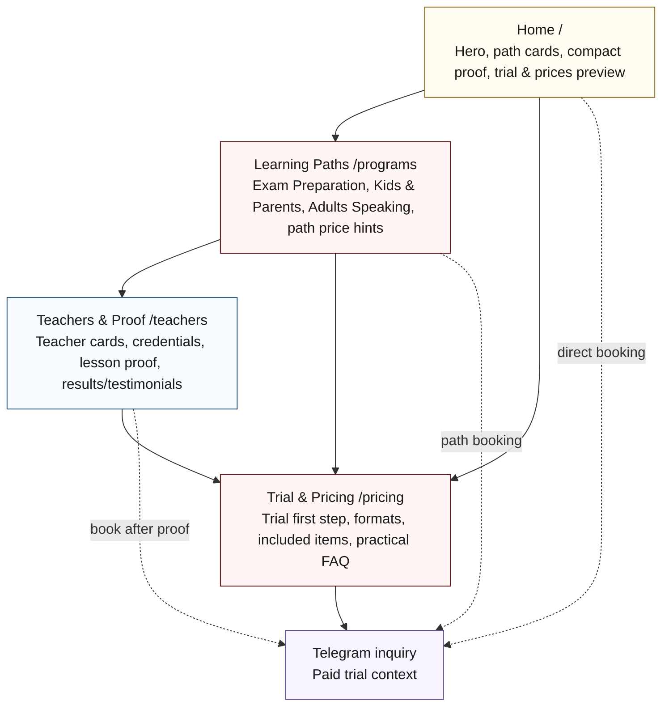

# Fluyo School Final UX Layout Visual Schema

Purpose: quick visual map of the finalized WDS planning structure. The canonical visual source is the HTML layout schema:

- `_bmad-output/planning-artifacts/fluyo-school-page-layout-schemas.html`

## Mermaid Schema

## Page Inventory

| Route | Page | Main contents | Primary job |
| --- | --- | --- | --- |
| `/` | Home | Global Header, Hero, Path Cards, Proof Snapshot, Trial & Prices Preview, Footer / Contact Strip | Make Fluyo understandable, show compact proof and price clarity, and route visitors quickly. |
| `/programs` | Learning Paths | Learning Paths Header, Exam Preparation, Kids & Parents, Adults Speaking, Path Price Hints, CTA Strip | Gather the three audience paths in one page so visitors can choose fit without route sprawl. |
| `/teachers` | Teachers & Proof | Trust Header, Teacher Cards, Credentials Proof, Lesson Proof, Results And Testimonials, Trust CTA Strip | Make teacher, lesson, and outcome trust visible before booking or price comparison. |
| `/pricing` | Trial & Pricing | Trial First Step, Individual Format, Pair Format, Mini-Group Format, What Is Included, Practical FAQ, Final Booking CTA | Give commercial clarity and convert qualified visitors to Telegram. |

## Source Module Migration

| Existing Source Module | New Route Use |
| --- | --- |
| 01.1 Landing Page / Hero | `/` Home |
| 01.2 Exam Preparation Path | `/programs` Exam Preparation block |
| 01.3 How Learning Works | `/programs` diagnostic cue and `/pricing` trial-first-step |
| 01.4 Programs And Pricing | `/` price preview, `/programs` price hints, `/pricing` full pricing |
| 02.1 Kids / Parents Path | `/programs` Kids & Parents block |
| 02.2 Teachers | `/teachers`, compact cue from `/programs` if needed |
| 02.3 Lesson Experience | `/teachers`, compact cue from `/programs` if needed |
| 02.4 Results / Testimonials / FAQ / Final CTA | Proof on `/teachers`, practical FAQ and final CTA on `/pricing` |
| 03.1 Audience Paths | `/` Path Cards and `/programs` orientation |
| 03.2 Adults Path | `/programs` Adults Speaking block |
| 03.3 Why Fluyo | Selective adult/trust reasons on `/programs` and `/teachers` |

## Notes

- The existing single-page HTML prototype remains a historical implementation preview.
- The earlier six-route split is superseded.
- Production implementation should create four route-level pages from this IA.
- Mock launch content for prices, teacher profiles, proof, testimonials, and lesson visuals remains preview-only.
